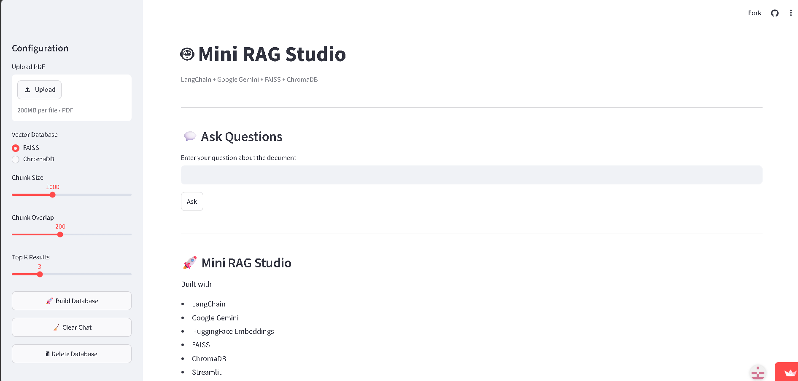
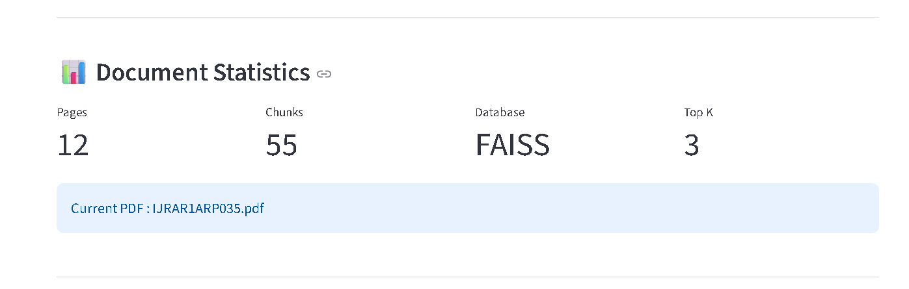
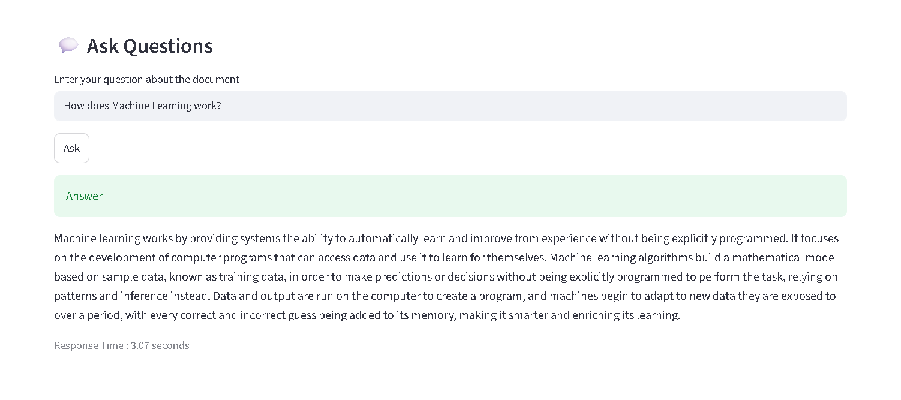
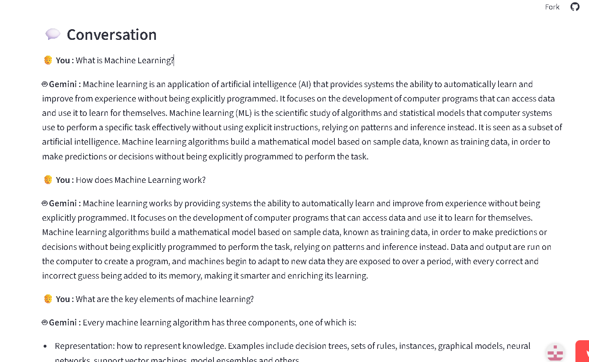
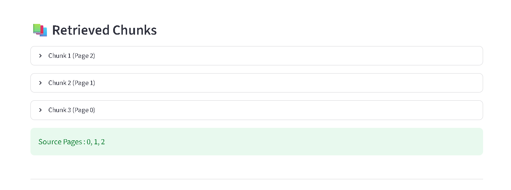

# Mini RAG Chatbot


An interactive **Retrieval-Augmented Generation (RAG)** application that enables users to upload PDF documents and ask natural language questions about their content. The application retrieves the most relevant information using semantic search and generates context-aware answers with **Google Gemini**.

## Live Demo

🔗 **Live Demo:** <https://mini-rag-chatbot.streamlit.app/>

> **Note:** The application may take a few seconds to load if it has been inactive.

---

## Features

- Upload and analyze PDF documents
- Ask questions in natural language
- AI-powered responses using Google Gemini
- Semantic search with HuggingFace embeddings
- Choose between **FAISS** and **ChromaDB**
- Adjustable chunk size and overlap
- Configurable Top-K retrieval
- Document statistics dashboard
- View retrieved document chunks
- Display source page numbers
- Conversation history
- Clear chat history
- Delete vector database
- Interactive Streamlit interface

---

## 🛠️ Tech Stack

| Category | Technology |
|----------|------------|
| Language | Python |
| Frontend | Streamlit |
| Framework | LangChain |
| LLM | Google Gemini |
| Embeddings | HuggingFace (all-MiniLM-L6-v2) |
| Vector Database | FAISS / ChromaDB |
| PDF Loader | PyPDFLoader |
| Text Splitter | RecursiveCharacterTextSplitter |

---

## Architecture

```text
          PDF Upload
               │
               ▼
      Extract PDF Content
               │
               ▼
     Split into Text Chunks
               │
               ▼
 Generate HuggingFace Embeddings
               │
               ▼
 Store in FAISS / ChromaDB
               │
               ▼
        User Question
               │
               ▼
     Similarity Search (Top-K)
               │
               ▼
    Google Gemini Generates
      Context-Aware Answer
```

---

## Project Structure

```text
Mini_RAG_Chatbot/
│
├── app.py
├── requirements.txt
├── .gitignore
├── .gitattributes
│
├── data/
│
├── database/
│   ├── faiss_db/
│   └── chroma_db/
│
├── images/
│   ├── homepage.png
│   ├── Chat_interface1.png
│   ├── Chat_interface2.png
│   ├── Document_statistics.png
│   └── Retrieved_Chunks.png
│
├── utils/
│   ├── embeddings.py
│   ├── loader.py
│   ├── rag_chain.py
│   ├── splitter.py
│   └── vectorstore.py

```
---

## Installation

### Clone the repository

```bash
git clone https://github.com/IshaniAggarwal/Mini_RAG_Chatbot.git
cd Mini_RAG_Chatbot
```

### Create a virtual environment

```bash
python -m venv venv
```

Activate it.

**Windows**

```bash
venv\Scripts\activate
```

**Linux / macOS**

```bash
source venv/bin/activate
```

### Install dependencies

```bash
pip install -r requirements.txt
```

### Configure Environment Variables

Create a `.env` file and add your Google Gemini API key.

```env
GOOGLE_API_KEY=YOUR_API_KEY
```

### Run the application

```bash
streamlit run app.py
```

---

## How to Use

1. Upload a PDF document.
2. Select **FAISS** or **ChromaDB**.
3. Adjust chunk size, overlap, and Top-K if required.
4. Click **Build Database**.
5. Ask questions about the uploaded document.
6. View the AI-generated answer along with retrieved chunks and source pages.

---

## Screenshots

### Homepage



### Document Statistics



### Chat Interface

| Ask Question | Conversation |
|--------------|--------------|
|  |  |

### Retrieved Chunks



---

## Skills Demonstrated

- Retrieval-Augmented Generation (RAG)
- LangChain Framework
- Google Gemini Integration
- Semantic Search
- Vector Databases (FAISS & ChromaDB)
- HuggingFace Embeddings
- Prompt Engineering
- Streamlit Application Development

---

## Future Enhancements

* Support multiple PDF uploads
* OCR for scanned PDFs
* Multi-document retrieval
* Streaming AI responses
* Export chat history
* Docker containerization

---

## 👩‍💻 Author

**Ishani Aggarwal**

- 💼 **LinkedIn:** [Ishani Aggarwal](https://www.linkedin.com/in/ishani-aggarwal-643259320/)
- 💻 **GitHub:** [IshaniAggarwal](https://github.com/IshaniAggarwal)

Feedback and suggestions are always welcome.

